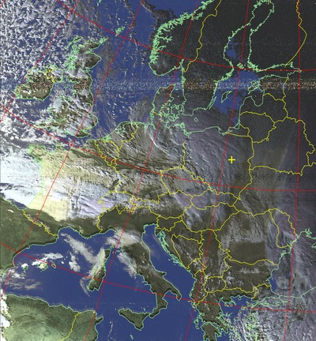

# autowx2

This is a rewritten and fine-tuned version of tools for the automatic weather satellite images capturing. Most directly it bases on cyber-atomus' [autowx](https://github.com/cyber-atomus/autowx) and my fork of autowx. The main differences between this project **autowx2** and previously created tools:
- high modularity - all recording and processing are done by separate scripts (modules? plugins?), which can be easily configured to meet one's needs. The main module is devoted to the capture of weather data from the NOAA satellites.
- configurability - most (all?) variables can be set up in the config file. For both: the main program and the NOAA module.
- simplicity (not sure if this is true). List of observed satellites is defined in one place only (the config file) and can be easily modified.

# hardware requirements

- usb dvbt dongle, like RTL2832 DVB-T tuner
- antenna good enough to capture the signal of your interest. For antenna dedicated for capturing NOAAs telemetry, see a [simple 137 MHz V-Dipole](https://www.rtl-sdr.com/simple-noaameteor-weather-satellite-antenna-137-mhz-v-dipole/), for example. When you want to use the script _also_ for other applications (capturing APRS signals, using `dump1090` for tracking airplanes), any broadband antenna should be good.

# system requirements

- python 2.7 and bash (sh, csh will be also OK)
- [pypredict](https://github.com/nsat/pypredict) for prediction of satellite passes
- `rtl-sdr` - can be found in many distributions (`aptitude install rtl-sdr`)
- `kal` from `kalibrate-rtl` (or [any of its forks](https://github.com/steve-m/kalibrate-rtl/network)) - if you want to calibrate your dongle periodically; may not be necesarry for good dongles with a stable drift.

# how to use

To be written.

# to do

## to do

- [ ] good README.md file
- [ ] logs to file, not only to screen
- [ ] plots of the dongle shift drift
- [ ] average dongle shifts from the last n measurements 
- [ ] coś lepszego niż `kal`, żeby było bardziej idioten proof i error proof
- [ ] coś do robienia w wolnej chwili
- [ ] efficiently kill aprs or other app from the python - [ ] now it remains running in te background... (multimon)
- [ ] run recordings on the specified fixed time (for weather fax, for example)
- [ ] ISS / rtl_fm parameters for recording
- [ ] any other cool satellites to record and process?

## to test

- [ ] move all recordings to the bash file
- [ ] noaa.sh
  - [ ] noaa_record.sh
  - [ ] noaa_process.sh
  

## done!

- [x] recording options
- [x] bash scripts global config file
- [x] if newdongleShift != '' # WARNING and newdongleShift is numeric:
